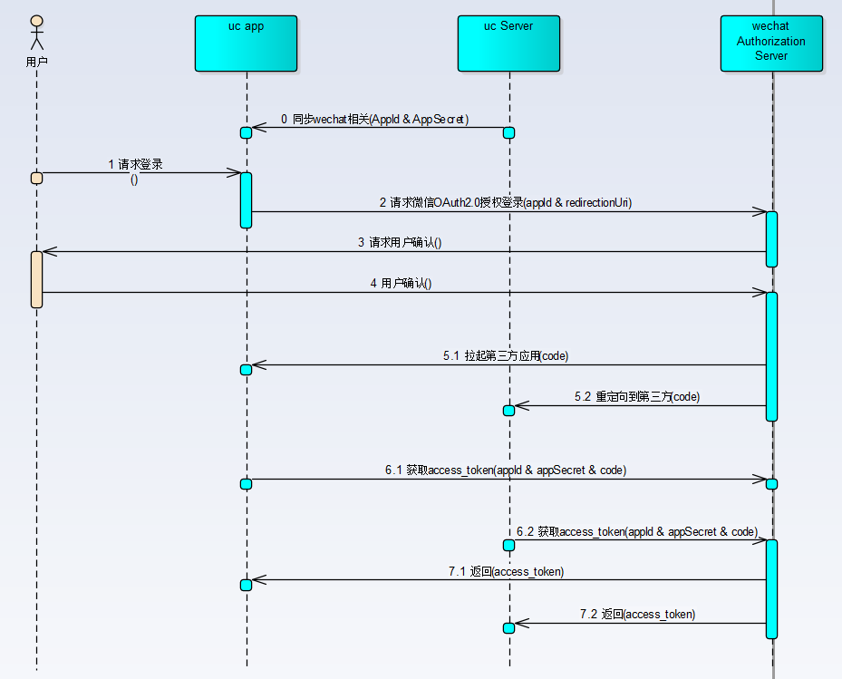

微信提供了基于OAuth 2.0 Authorization Code模式的授权登录实现。

##实现原理

(0) 同步应用的AppId和AppSecret。

按照微信开发文档中的说明，如下：

>1、Appsecret 是应用接口使用密钥，泄漏后将可能导致应用数据泄漏、应用的用户数据泄漏等高风险后果；存储在客户端，极有可能被恶意窃取（如反编译获取Appsecret）；
>2、access_token 为用户授权第三方应用发起接口调用的凭证（相当于用户登录态），存储在客户端，可能出现恶意获取access_token 后导致的用户数据泄漏、用户微信相关接口功能被恶意发起等行为；
>3、refresh_token 为用户授权第三方应用的长效凭证，仅用于刷新access_token，但泄漏后相当于access_token 泄漏，风险同上。

因此如果应用本身有云端实现，最好将AppSecret这些敏感信息保存在云端，在需要的时候，向云端请求。避免存在泄漏的危险。

(1)用户请求登录

(2)请求微信OAuth2.0授权登录
请求参数如下：
>**appId**  应用的appId。必选 
>**scope**  应用授权作用域。必选 
>**state**  用于保持请求和回调的状态，授权请求后原样带回给第三方。该参数可用于防止csrf攻击（跨站请求伪造攻击），建议第三方带上该参数，可设置为简单的随机数加session进行校验。可选。 

(3)请求用户确认

(4)用户确认

接下来的access_token请求，可以分为两种方式实现。一种是由应用app端发起，一种是由应用云端发起。

###应用app发起

(5.1)拉起应用

(6.1)应用发起access_token请求

(7.1)返回access_token

###应用云端发起

(5.2)重定向到第三方云端

(6.2)云端发起access_token请求

(6.3)返回access_token

##参考资料

[移动应用微信登录开发指南](https://open.weixin.qq.com/cgi-bin/showdocument?action=dir_list&t=resource/res_list&verify=1&id=open1419317851&token=3a02b448ab92e738fd21fe373b4156c4f0d9e2cb&lang=zh_CN) 
[授权后接口调用（UnionID）](https://open.weixin.qq.com/cgi-bin/showdocument?action=dir_list&t=resource/res_list&verify=1&id=open1419317853&token=3a02b448ab92e738fd21fe373b4156c4f0d9e2cb&lang=zh_CN) 